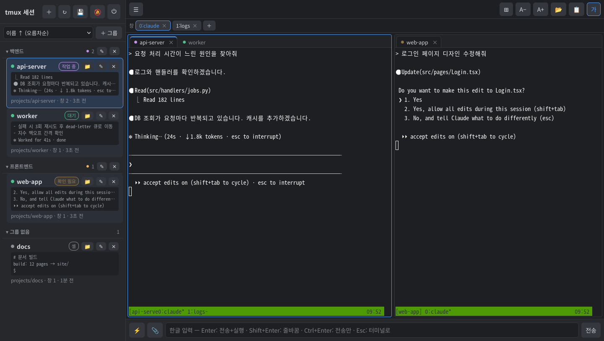
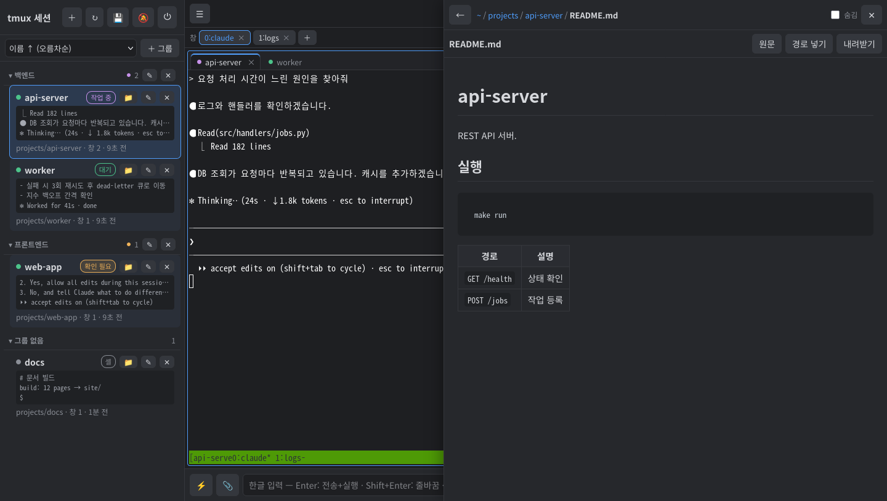
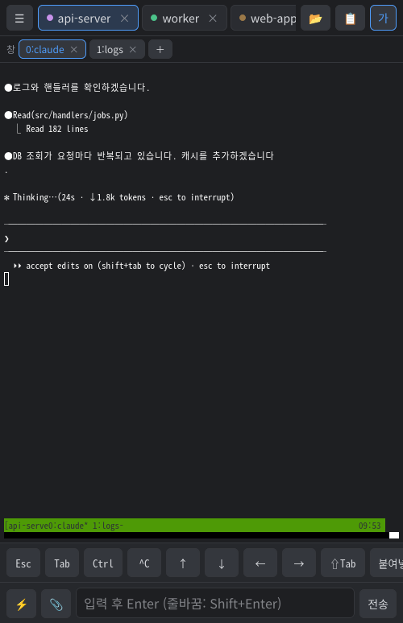

# tmux-web-monitor

**English** | [한국어](README.ko.md)

A web service for viewing and attaching to the tmux sessions running on your PC from a browser.
It was built for keeping several Claude Code sessions in tmux and checking on them or working in them from a PC or a phone.



| File viewer | Phone |
|---|---|
|  |  |

The UI is in Korean.

## Features

- **Session list**: last 3 lines of output and a status per session (shell, running, Claude working / needs input / idle), sorting, groups (can be nested)
- **Terminal**: attaches to tmux sessions with xterm.js; reconnects automatically when the connection drops
- **Split view**: drag a tab to split up/down/left/right, a tab bar per area, resize with the dividers
- **Virtual desktops**: each desktop keeps its own split layout and tabs; switch with Alt+1–9. A session can be on several desktops, and setups can be saved on the server and loaded on other devices
- **Session management**: create (working folder, start command), rename, kill; switch and close tmux windows/panes
- **Input**: input box for Korean (IME) text, buttons for frequently used commands, mobile keys (Esc, Ctrl, arrows, …)
- **Files**: browse under the home folder, view Markdown and code, upload files. Editing, copy, move and delete are optional (off by default)
- **Copy**: selecting text by dragging in the terminal or file viewer copies it to the clipboard of the device you are using
- **Notifications**: web push when a Claude task finishes or needs input (requires HTTPS)
- **Save/restore sessions**: the tmux-persist add-on saves periodically and restores after a reboot
- **Orchestrator (optional)**: runs several Claude sessions from an organization and process definition, with an approval inbox, org chart and emergency stop

Claude status is detected from text on the screen (`esc to interrupt`, `Do you want to…`, etc.).
If Claude Code changes its screen layout, the status may be wrong.

## Requirements

- Linux (used on Ubuntu/Debian) or macOS
- tmux 3.x, Python 3.10 or later
- nginx, if you use the HTTPS install mode

The macOS install script has been written but not tested on a real Mac.

## Install

```bash
git clone https://github.com/jyhan-89/tmux-web-monitor.git
cd tmux-web-monitor
install/ubuntu.sh          # macOS: install/macos.sh
```

The install script sets up packages, a Python virtual environment, a login account and auto-start
(systemd user service / launchd). It is safe to run again.

| Mode | Option | URL |
|---|---|---|
| Same network (default) | none | `http://<IP>:8765/dev` |
| HTTPS (nginx + self-signed certificate) | `--https` | `https://<IP>/dev` |
| This PC only | `--local` | `http://localhost:8765/dev` |

Other options

- `--with-persist`: also install the tmux-persist add-on (see below)
- `--with-orchestrator`: also install the orchestrator (see below)
- `--no-service`: do not register auto-start (run `./run.sh` yourself)
- `-y`: answer yes to all questions (except creating the account)
- Change the port: `PORT=9000 install/ubuntu.sh`

The default mode is plain HTTP, so browsers show "Not secure", and web push, the paste button and
installing as a home-screen app are not available.
If you need them, install with `--https` or use Tailscale Serve (below).

### Certificates in HTTPS mode

`--https` creates a CA for this PC and issues a certificate for its IP addresses with that CA.
To remove the browser warning, download `http://<IP>/dev/ca.crt` on each device once and install it as a trusted root certificate.
If the IP changes, run the install script again; only the server certificate is reissued (the CA stays the same).

## Account

The install script asks you to create an account. To create it later or reset a forgotten password,
open `http://localhost:8765/dev/setup` **in a browser on the server PC**.

- Account and server settings (such as allowing file edits) can only be changed when connecting from the server PC via localhost
- Changing the password logs out every device
- From the command line: `.venv/bin/python auth.py [username]`

## Usage

| To do | How |
|---|---|
| Open a session | Click it in the list. It opens as a tab in the selected area |
| Split the view | Drag a tab or a session from the list to an edge of the terminal area |
| Desktops | Number buttons at the top to switch, ＋ to add, right-click to rename/delete, drop a tab on a number to move it |
| Save/load desktop setups | ⋯ next to the desktop buttons. Stored on the server, so other devices and URLs can load them. After saving or loading, later changes are saved to that setup automatically (can be unlinked) |
| Session / group menu | Right-click in the list (phone: 📁 ✎ ✕ buttons) |
| Nested groups | Right-click a group → Create subgroup / Move into another group, or type `parent/child` as the group name |
| Type Korean | Type in the input box at the bottom, then Enter |
| See earlier output | Mouse wheel / swipe up or down on a phone |
| Copy | Select by dragging (inside Claude's screen, Shift+drag or the setting below) |
| Browse files | 📂 at the top. Copy/move/delete via the right-click menu (when edits are allowed) |
| Save/restore | 💾 above the session list |

### Copying from the Claude Code screen

In apps that use the mouse, such as Claude Code, dragging is sent to the app.
To receive what the app copies on your device's clipboard, let tmux pass the clipboard sequence (OSC 52) through.
tmux's default (`external`) ignores it.

```bash
tmux set -s set-clipboard on
echo 'set -s set-clipboard on' >> ~/.tmux.conf
```

### Save/restore sessions (tmux-persist)

`addons/tmux-persist/` is a script that saves tmux sessions and recreates them.
It saves window/pane layout, working folders and screen contents, and reopens a running Claude Code with
`claude --resume <conversation ID>`.

- With `--with-persist`, it saves every 5 minutes and restores at login (boot)
- From 💾 in the web UI you can save now or restore any snapshot. Existing sessions are skipped
- Command line: `tmux-persist save | restore [snapshot] | list`

### Orchestrator (optional, experimental)

Runs several Claude Code sessions automatically according to an organization (divisions, departments, roles) and a process
(stages, gates, rework loops). People only approve or reject in the inbox; the sessions exchange directives for the rest.

```
inbox (📝) / org chart (🏢) ── tmux-web server ── orchestrator (separate service)
                                    │                │ sends directives, wakes sessions, runs gates
                               history (JSONL)   role sessions (worktree + CLAUDE.md + permissions)
```

Install with `install/ubuntu.sh --with-orchestrator`. Role prompts and an example definition are copied to
`~/.config/tmux-web/company/` and the `tmux-web-orchestrator` service is registered. Without definitions the orchestrator just waits.

**Definition files** (`~/.config/tmux-web/company/`, every save is committed to git in that folder)

| File | Contents |
|---|---|
| `org.yaml` | Divisions, departments and roles; model, head count and permissions (`allowed_tools`, `can_edit`) per role; each division's git repository |
| `process.yaml` | Nodes (role, gate, next node on pass and on failure, retries, approval required) and rework loop limits |
| `documents.yaml` | Document ownership; which roles may send and receive each directive type |
| `prompts/` | `common.md` (how to handle directives) and per-role and per-node prompts |

Example: `company/examples/mw-minimal/`. Definitions are validated on save; a rule violation is rejected with the rule name and location.

**How it works**

- Role sessions are named `division-dept-role[-layer|number]` (e.g. `mw-impl-impl-skeleton`) and grouped under `division/dept` in the session list
- The launcher creates a git worktree and branch `feat/<feature>/<layer>`, `CLAUDE.md`, permissions (`.claude/settings.json`; tools outside the list are denied without asking) and hooks for each session. It accepts Claude Code's folder-trust prompt for the worktrees it creates
- Judgment and procedure inside a session come from the `CLAUDE.md` rules; the orchestrator only delivers directives, wakes sessions ("inbox 확인"), runs gates and moves between nodes
- Sessions handle directives with the `directive` command (list, show, ack, start, done, block, reject, send). A node counts as finished only with `done --ref <branch@commit>`
- Gates are read-only scripts in `gates/`. Connect vendor build, test and SIL tools in `gates/adaptive/env.sh` (`BUILD_CMD`, `TEST_CMD`, `STATIC_CMD`, `ARXML_VALIDATE`, `SIL_RUNNER`); when empty, gates only check the output files
- Session state comes from directives first, then Claude Code hooks (within 30 seconds), then screen detection

**UI**

| To do | How |
|---|---|
| Start a feature | 📝 inbox → new feature (division, feature name, request) |
| Approve | 📝 inbox: approve / reject / request changes (reject and changes need a reason). New approvals send a push notification |
| View and edit the organization and process | 🏢 org chart: role node color is the session state, click a node to edit it, double-click a division for its process |
| Force a node | 📝 inbox → features in progress → move node |
| Stop everything | ⏹ emergency stop above the session list (Esc to every Claude session, automation paused). Resume from the banner |
| Session history | Right-click a session → recent history |

**Notes**

- Permissions are a guard against mistakes. A role with Bash can get around them, so enforce ownership with the gate (`ownership_check.sh`) and protected branches on the git server
- The integrate node runs `git push origin HEAD:main`, so set each division's `repo` to a bare repository or a git server URL
- NAS backup: install with `TMUX_WEB_NAS_ROOT` set to sync history, definitions, `coord/` and git mirrors every hour
- Manual test procedures are in `tests/manual/README.md`

## Remote access

This service gives a shell in the browser. **Do not expose it directly to the internet** (e.g. by port forwarding).
Use a VPN when you are away.

With [Tailscale](https://tailscale.com):

```bash
curl -fsSL https://tailscale.com/install.sh | sh
sudo tailscale up
tailscale ip -4                       # connect to this IP
```

With Tailscale Serve, the `*.ts.net` address gets a publicly trusted certificate, so no CA has to be installed on each device.
(Enable MagicDNS and HTTPS Certificates in the admin console first. It conflicts with the `--https` mode on port 443.)

```bash
sudo tailscale serve --bg http://127.0.0.1:8765     # https://<machine>.<tailnet>.ts.net/dev
```

## Configuration

| Environment variable | Default | Description |
|---|---|---|
| `HOST` | `127.0.0.1` | Address to listen on (`0.0.0.0` in the same-network mode) |
| `PORT` | `8765` | Port |
| `BASE_PATH` | `/dev` | URL path |
| `TMUX_WEB_FILES_ROOT` | `~` | Root of the file browser |
| `TMUX_WEB_CONFIG` | `~/.config/tmux-web` | Settings and data folder |
| `TMUX_WEB_AUTH` | `~/.config/tmux-web/auth.json` | Account file |
| `TMUX_WEB_TLS` | `~/.config/tmux-web/tls` | Self-signed certificate folder |
| `TMUX_PERSIST_DIR` | `~/.local/share/tmux-persist` | Snapshot folder |
| `TMUX_WEB_DATA` | `~/.local/share/tmux-web` | History, directives, approvals, orchestrator state, worktrees |
| `TMUX_WEB_MAX_ACTIVE` | `4` | Role sessions allowed to work at the same time (orchestrator) |
| `TMUX_WEB_NAS_ROOT` | (none) | NAS backup path |

`~/.config/tmux-web/` holds the account, login sessions, command buttons and groups, saved desktop setups, web push keys and
subscriptions, and certificates. It is not part of the repository.
The desktop layout that is currently open is stored in the browser (per URL).

## Administration

```bash
systemctl --user status tmux-web        # status (macOS: launchctl list kr.tmuxweb.server)
systemctl --user restart tmux-web       # restart
journalctl --user -u tmux-web -n 50     # logs (macOS: ~/Library/Logs/tmux-web.log)
```

To update, `git pull` and run the install script again with the same options.
Open browser tabs show a "new version available" notice.

Uninstall (Ubuntu)

```bash
systemctl --user disable --now tmux-web && rm ~/.config/systemd/user/tmux-web.service
sudo rm /etc/nginx/sites-enabled/tmux-web && sudo systemctl reload nginx   # if installed with --https
addons/tmux-persist/uninstall.sh                                            # if installed with --with-persist
rm -rf ~/.config/tmux-web                                                   # also remove account and settings
```

## Security

- Anyone who logs in can use a shell with the PC user's permissions. Use it only on networks you trust
- Passwords are stored as scrypt hashes; 5 failed attempts within 5 minutes block that IP for 5 minutes
- The file browser rejects paths outside `TMUX_WEB_FILES_ROOT` (including via symlinks), and editing is off by default
- In the default mode (HTTP), passwords and terminal contents are not encrypted

## Layout

```
server.py            FastAPI server (API, WebSocket terminal)
tmuxctl.py           tmux queries and status detection
auth.py, store.py    accounts, settings storage
push.py              status monitoring, web push
static/              web UI (index.html, app.js, app.css, login/setup pages)
install/             install scripts (Ubuntu, macOS)
deploy/              systemd unit, nginx config, certificate script
addons/tmux-persist/ session save/restore add-on
orchestrator.py      orchestrator (node transitions, gates, approvals, time limits, recovery)
launcher.py          role session setup (worktree, CLAUDE.md, permissions, hooks)
models.py            organization/process/document definitions and validation
directives.py        directive queue; bin/directive is the in-session command
approvals.py         approval items
history.py           history (JSONL)
*_api.py             definition, control, directive, approval, event and history APIs
company/             role and node prompts, example definition
gates/               gate scripts
hooks/               Claude Code hook script
ops/                 NAS sync
```

## License

[PolyForm Noncommercial 1.0.0](LICENSE)

- Free for individuals, educational institutions, public research organizations and nonprofits
- Use by companies or for commercial purposes (including internal use) requires a separate commercial license: jyhan.dev@gmail.com

## Contributing

Pull requests are not accepted. Please report bugs and suggestions in Issues.
